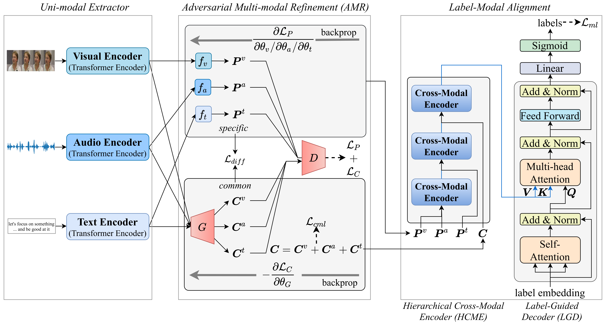

  

# TAILOR
> Pytorch implementation for Tailor Versatile Multi-modal Learning for Multi-label Emotion Recognition

## Paper
[**Tailor Versatile Multi-modal Learning for Multi-label Emotion Recognition**](https://arxiv.org/abs/2201.05834)

To be published in AAAI 2022

Please cite our paper if you find our work useful for your research:
```tex
@misc{zhang2022tailor,
      title={Tailor Versatile Multi-modal Learning for Multi-label Emotion Recognition}, 
      author={Yi Zhang and Mingyuan Chen and Jundong Shen and Chongjun Wang},
      year={2022},
      eprint={2201.05834},
      archivePrefix={arXiv},
      primaryClass={cs.CV}
}
```
## Overview

### Overall Architecture for TAILOR
<p align="center">


TAILOR comprises three modules: Unimodal Extractor, Adversarial Multi-modal Refinement and Label-Modal Alignment. Unimodal Extractor is designed to extract the visual features, audio features and text features with sequence level context separately. Adversarial Multi-modal Refinement is designed to extract common and private representations collaboratively. Label-Modal Alignment is designed to gradually fuse these representations in a granularity descent way and incorporated with label semantics to generate tailored label representation. 
## Usage

### Datasets

|CMU-MOSEI| [Aligned](https://drive.google.com/file/d/1A7HTBxle5AOFt66mqNIRDM3DOws_tNXH/view?usp=sharing) | [UnAligned](http://immortal.multicomp.cs.cmu.edu/raw_datasets/processed_data/cmu-mosei/seq_length_50/) |
| ---- | ---- | ---- |


Note that since the labels in the unaligned data are single-label, we only use the features, and the labels are obtained from the aligned data

### Model
the checkpoint for aligned data is [here](https://drive.google.com/file/d/1dgdoqtAq3LBwzqeH3DNx7R4QKwRiXeAi/view?usp=sharing)

### get started

1. the first step is clone this repo

```
git clone git@github.com:kniter1/TAILOR.git
```

2. Set up the environment (need conda prerequisite)

```
conda create -n env_name python==3.7
bash init.sh
```

3. Modify the data path in train.sh and start training
```
bash train.sh
```

4. If you want to load the trained model for inference, you can:
   
```
bash inference.sh
```
Note that modify the model path and data path

### Using CTC to train UnAligned data

If you want to train unaligned data, plesase install warp-ctc from [here](https://github.com/baidu-research/warp-ctc).

The quick version:
~~~~
git clone https://github.com/SeanNaren/warp-ctc.git
cd warp-ctc
mkdir build; cd build
cmake ..
make
cd ../pytorch_binding
python setup.py install
export WARP_CTC_PATH=/home/xxx/warp-ctc/build
~~~~

then add the following to model.py:
```
from warpctc_pytorch import CTCLoss
```

### Acknowledgement
Some portion of the code were adapted from the [UniVL](https://github.com/microsoft/UniVL) repo.
We thank the authors for their wonderful open-source efforts.


